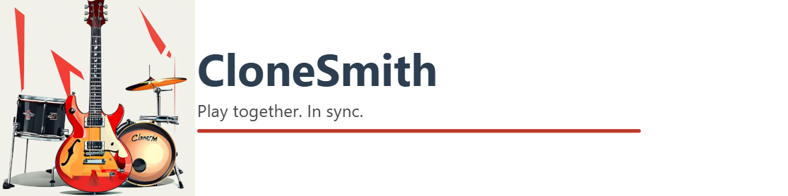
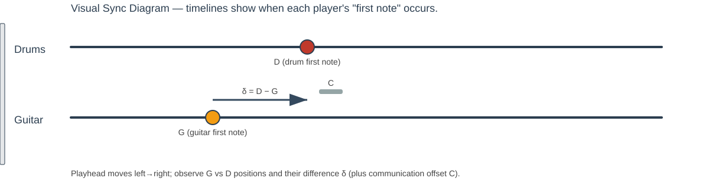

# 🎸🥁 CloneSmith

<p align="center">
  
</p>

> **Play together. In sync. Across machines, across games, across the internet.**

CloneSmith is the secret glue that lets a **Clone Hero drummer** and a **Rocksmith guitarist** jam the same song at the same time — perfectly synchronized — even when they're sitting in different rooms or different cities.

Both games have wildly different startup latencies, audio pipelines, and hardware quirks. CloneSmith measures all of that, stores it per song, and fires both games at exactly the right moment so the first note hits simultaneously on both screens.


## 🎬 See It In Action

[](https://www.youtube.com/watch?v=0TEhs2ZayoM)

> 👆 Click the thumbnail to watch the full demo on YouTube.

**Live every Friday at 20:00 CET** — catch us playing together live on Twitch:
**[twitch.tv/viciousviper79](https://www.twitch.tv/viciousviper79)**


## 🤔 Why Does This Exist?

When two people try to play music games together — one on Clone Hero (drums), one on Rocksmith (guitar) — they quickly run into a problem:


The result? One player is always ahead or behind. It sounds terrible and feels terrible.

**CloneSmith fixes it.** Measure once. Play forever in sync.


## ✨ Features


## 🏗️ How It Works

```
┌────────────────────────────────┐           ┌──────────────────────────────────┐
│   DRUM PLAYER (Linux/Windows)  │           │    GUITAR PLAYER (Windows)       │
│                                │           │                                  │
│  ┌──────────────────────────┐  │           │  ┌────────────────────────────┐  │
│  │    Clone Hero (drums)    │  │   stream  │  │    Rocksmith (guitar)      │  │
│  └──────────────────────────┘  │◄──────────│  └────────────────────────────┘  │
│                                │           │                                  │
│  ┌──────────────────────────┐  │  TCP:12345│  ┌────────────────────────────┐  │
│  │  drums_server.py         │◄─┼───────────┼──│  guitar_client.py (GUI)    │  │
│  │  - Receives start trigger│  │           │  │  - Selects song            │  │
│  │  - Fires keystroke       │  │           │  │  - Applies offset          │  │
│  │  - Time measurement      │  │           │  │  - Fires F1 / sends trigger│  │
│  └──────────────────────────┘  │           │  └────────────────────────────┘  │
└────────────────────────────────┘           └──────────────────────────────────┘
```


<p align="center">
  
</p>

This diagram animates a playhead across two timelines (Drums and Guitar). The guitar first-note `G` and drum first-note `D` positions are shown; the arrow between them represents the computed delta (δ = D − G). A small bar shows the static communication offset `C` that may affect perceived timing.

### The Sync Formula

Each player measures how many milliseconds pass from pressing "start" to hearing the first note. Call these **D** (drums) and **G** (guitar). Add a constant **C** for the streaming communication delay:

$$\delta = D - G + C$$


The guitar client handles all of this automatically once you enter the two measurements.


## 🚀 Quick Start

### 1 · Drum Player (Linux)

```bash
# Clone the repo
git clone https://github.com/heiner-palmen/CloneSmith
cd clonesmith/src/anyOs

# Set up the Python virtual environment
./setup_venv.sh          # or setup_venv.ps1 on Windows

# (Linux only) Allow non-root input device access
./setup_input_udev.sh

# Start the drum server
./run_drums_server.sh    # or run_drums_server.ps1 on Windows
```

The server listens on **TCP port 12345** for incoming trigger commands.


### 2 · Guitar Player (Windows)

```powershell
# Navigate to the windows folder
cd clonesmith\src\windows

# Set up the Python virtual environment
.\setup_venv.ps1

# Copy and edit your config
Copy-Item example_guitar_client_config.json guitar_client_config.json
# Edit guitar_client_config.json: set "server" to the drum machine's IP or hostname
```

**`guitar_client_config.json`**:
```json
{
    "server": "192.168.1.42",
    "static_offset": 250
}
```

Then launch the guitar client:
```powershell
.\run_guitar_client.ps1
```


### 3 · Measure & Add a Song

1. Both players load the same song and get ready.
2. Each player uses the **Time Measure** feature:
   - Press **A** to start the timer when the song starts
   - Press **Q** (drum) or **A again** (guitar GUI) when the agreed first note hits
3. Share your two times.
4. In the **Guitar Client GUI** → click **Add Song** → enter artist, song name, drum ms, guitar ms → click **Add**.
5. Done. The offset is stored and ready.


### 4 · Play Together

1. Both players load the song and hover over the start screen.
2. Guitar player selects the song in the GUI.
3. Guitar player presses **F1** (or the button in the GUI).
4. Both games start — drum server receives the network trigger and fires its keystroke — with the computed delay applied so first notes land at the same time.

Need to reset? Press **F2** to cancel the current song and return the drum machine to the trigger-ready state.


## 🗂️ Project Structure

```
src/
├── anyOs/                         # Drum server — runs on Linux or Windows
│   ├── drums_server.py            # TCP server + input automation + stopwatch
│   ├── run_drums_server.sh/.ps1   # Launch scripts
│   ├── setup_venv.sh/.ps1         # Virtual environment setup
│   ├── setup_input_udev.sh        # udev rules for evdev input access (Linux)
│   ├── requirements.txt           # keyboard, evdev, requests
│   └── example_timemeasure_config.json  # Telegram bot config template
│
├── windows/                       # Guitar client — runs on Windows
│   ├── guitar_client.py           # Tkinter GUI controller
│   ├── run_guitar_client.ps1      # Launch script
│   ├── setup_venv.ps1             # Virtual environment setup
│   ├── songs.json                 # Per-song offset database (auto-managed)
│   └── example_guitar_client_config.json  # Server config template
│
└── HOW_IT_WORKS.md                # Full technical documentation
```


## 🌐 Playing Over the Internet

To play with someone outside your local network:

1. **Port forward** TCP `12345` on the drum machine's router to the drum machine's LAN IP.
2. Set up **Dynamic DNS** (DuckDNS, No-IP, or your router's built-in DDNS) to get a stable hostname.
3. Set `"server"` in `guitar_client_config.json` to that hostname.
4. Test from a mobile connection before your session.

> ⚠️ **Security note**: The protocol is unauthenticated. For best security, use a **VPN** (WireGuard recommended) or **SSH tunnel** instead of opening port 12345 directly to the internet. See [HOW_IT_WORKS.md](HOW_IT_WORKS.md#remote-access-port-forwarding--dynamic-dns) for details.


## 🛠️ Tech Stack

| Component | Technology |
|---|---|
| Drum Server | Python 3, `socket`, `evdev` (Linux) / `keyboard` (Windows) |
| Guitar Client | Python 3, `tkinter`, `keyboard`, `socket` |
| Time Measurement | `evdev` raw input or global keyboard hooks |
| Telegram notifications | `requests` → Telegram Bot API |
| Song database | Plain `songs.json` |
| IPC protocol | Raw TCP sockets, port 12345 |


## 💡 What Could Make This Even Better

These are ideas worth exploring to take CloneSmith to the next level:
- Simple auth for the TCP protocol (HMAC)
- Packaged releases (.exe / AppImage)
- Themed Guitar Client GUI - Darkmode, custom fonts, rock-inspired design


## 🤝 Contributing

Pull requests and issues are welcome! If you try CloneSmith and have feedback, ideas, or bugs to report, open an issue — or show up live at [twitch.tv/viciousviper79](https://www.twitch.tv/viciousviper79) on a Friday and tell us in chat.


## 📄 License

This project is licensed under the MIT License. See the full text in `LICENSE`.

Copyright (c) 2026 CloneSmith contributors


<p align="center">
  
  Made with 🤘 for people who refuse to play alone.
</p>
